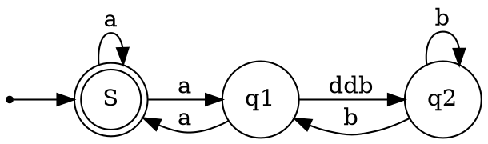

#

\%20dx)

$$

$$

```mermaid
graph TD;
    A-->B;
    A-->C;
    B-->D;
    C-->D;
```

$$
f(x) = \int_{-\infty}^\infty \hat f(\xi)\,e^{2 \pi \xi x} \,d\xi
$$

```graphviz
digraph finite_state_machine {
    rankdir=LR;
    size="8,5"

    node [shape = doublecircle]; S;
    node [shape = point ]; qi

    node [shape = circle];
    qi -> S;
    S  -> q1 [ label = "a" ];
    S  -> S  [ label = "a" ];
    q1 -> S  [ label = "a" ];
    q1 -> q2 [ label = "ddb" ];
    q2 -> q1 [ label = "b" ];
    q2 -> q2 [ label = "b" ];
}
```